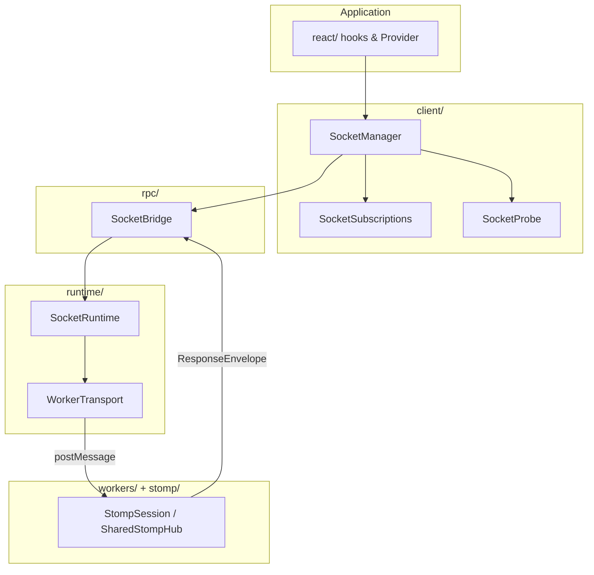
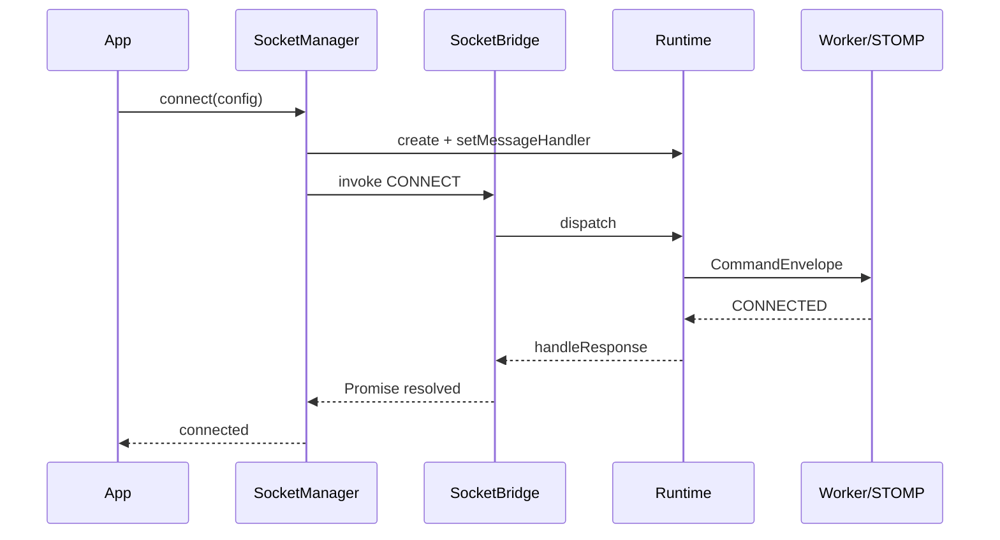
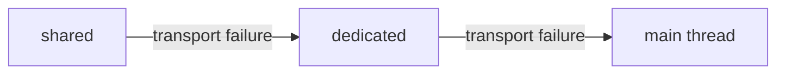

# 아키텍처

## 레이어 개요

## 연결 수명주기

## Runtime Fallback

`SocketRuntimeFallbackController`가 chain을 관리합니다. SharedWorker를 쓸 수 없거나 hub 연결이 실패하면 dedicated로, Worker API 자체가 없으면(SSR) main thread로 동작합니다.

## 메시지 계약

모든 cross-boundary 메시지는 `protocol/`의 `CommandEnvelope` / `ResponseEnvelope`를 따릅니다.

- **RPC**: `CONNECT`, `PING`, `SUBSCRIBE`, `SEND_MESSAGE` — `commandId` + Promise
- **Post**: `UNSUBSCRIBE`, `DISCONNECT` — 즉시 dispatch

## 모듈 문서

각 폴더 README에서 파일별 책임을 확인할 수 있습니다.

| 모듈 | 문서 |
|------|------|
| protocol | [protocol](/modules/protocol) |
| rpc | [rpc](/modules/rpc) |
| client | [client](/modules/client) |
| runtime | [runtime](/modules/runtime/) |
| react | [react](/modules/react/) |
| stomp | [stomp](/modules/stomp) |
| workers | [workers](/modules/workers/) |
